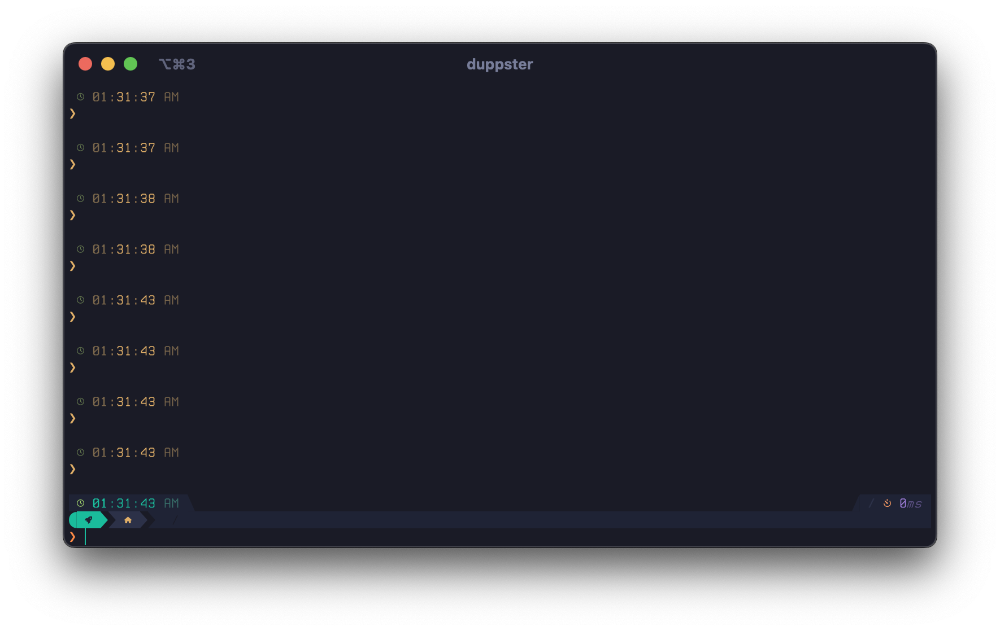

# Dotfiles

The personal configuration files for Mike Mackintosh

## Terminal




## Installation

1. Clone this repository to your home directory:
   ```bash
   git clone https://github.com/mikemackintosh/dotfiles.git ~/.dotfiles
   ```

2. Navigate to the dotfiles directory:
   ```bash
   ~/.dotfiles/install.sh
   ```

3. Install configurations as needed for your environment.

## Dependencies

- Oh My Posh for terminal prompt theming
- Additional dependencies vary by configuration

## Usage

After installation, the configurations will be automatically applied based on your system setup.

## License

This repository contains personal configuration files. Feel free to use and modify as needed for your own setup.